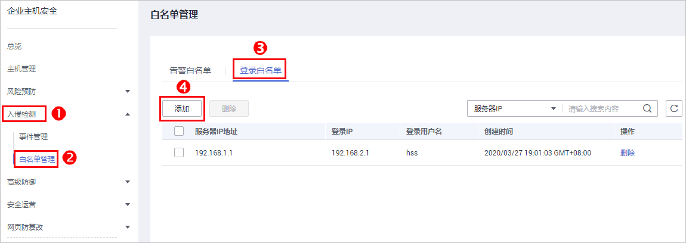

# 配置登录白名单

在登录白名单页面，您可以添加指定“登录IP“和“登录用户名“登录到指定“服务器IP“的登录白名单。添加登录白名单后，HSS将不会对该登录白名单内的合法登录事件上报登录告警。

您可以通过以下两种方式添加登录白名单：

-   处理告警事件时，将“账户暴力破解“和“账户异常登录“类型的告警事件加入到登录白名单，详细信息请参见[查看和处理入侵告警事件](查看和处理入侵告警事件.md)。
-   在“登录白名单“页面，添加登录白名单。

仅企业版、旗舰版支持白名单管理，网页防篡改版赠送旗舰版，包含旗舰版所有功能。

## 添加登录告警白名单

1.  [登录管理控制台](https://console.huaweicloud.com)。
2.  在页面左上角选择“区域“，单击，选择“安全  \>  企业主机安全“，进入企业主机安全页面。

    **图 1**  企业主机安全  
    

3.  进入“白名单管理“页面，选择“登录白名单“，单击“添加“，如[图2](#fig84424528346)所示。

    **图 2**  登录白名单  
    

4.  在“添加登录安全白名单“对话框中，输入“服务器IP“、“登录IP“和“登录用户名“，如[图3](#fig1371271816376)所示。

    > **说明：** 
    >-   “服务器IP“和“登录IP“支持IPv4地址。
    >-   “服务器IP“和“登录IP“支持单个IP、IP范围、IP掩码，以英文逗号分隔，例如：192.168.1.1、192.168.2.1-192.168.6.1、192.168.7.0/24。

    **图 3**  添加登录安全白名单  
    

5.  单击“确认“，完成登录白名单的添加。

## 其他操作

**删除登录白名单**

若需要删除已添加的登录白名单，勾选待删除的登录白名单，单击“删除“，或者在待删除服务器IP地址所在行，单击“删除“，删除登录白名单。

> **说明：** 
>执行删除操作后无法恢复，请谨慎操作。

