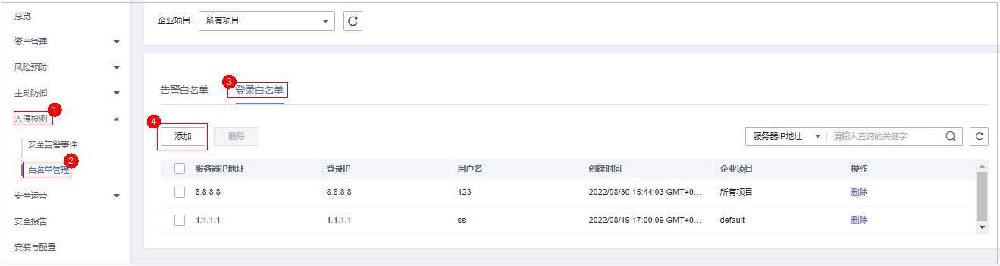

# 配置登录白名单

通过配置目标服务器IP、登录端IP以及登录端用户名完成登录白名单添加，添加后HSS对白名单内IP、用户名的登录、访问行为进行忽略。

> **说明：** 
>-   配置的目标服务器IP、登录端IP以及登录端用户名需同时满足白名单配置的信息，检测时才会忽略。
>-   如果将已经产生告警的目标IP通过[添加登录告警白名单](#section349913102296)方式加入白名单，加入白名单之后的检测会对目标IP进行忽略，但已经产生的告警不会自动放行，仍需对告警进行处理，处理详情请参见[查看入侵告警事件](查看入侵告警事件.md)。

您可以通过以下两种方式添加登录白名单：

-   处理告警事件时，将“帐户暴力破解“和“帐户异常登录“类型的告警事件加入到登录白名单，详细信息请参见[查看入侵告警事件](查看入侵告警事件.md)。
-   在“登录白名单“页面，添加登录白名单。

## 约束限制

需开启旗舰版、网页防篡改版、容器版任一防护版本。

## 添加登录告警白名单

1.  [登录管理控制台](https://console.huaweicloud.com/?locale=zh-cn)。
2.  在页面左上角选择“区域“，单击，选择“安全与合规 \> 主机安全服务”，进入主机安全平台界面。

    **图 1**  进入主机安全  
    

3.  选择“入侵检测  \>  白名单管理  \>  登录白名单“，进入“白名单管理“页面，单击“添加“。

    > **说明：** 
    >如果您的服务器已通过企业项目的模式进行管理，您可选择目标“企业项目“后查看或操作目标企业项目内的资产和检测信息。

    **图 2**  添加登录白名单  
    

4.  在“添加登录安全白名单“对话框中，输入“服务器IP“、“登录IP“和“登录用户名“。

    **表 1**  登录安全白名单参数说明

    
    <table><thead align="left"><tr id="row0328184931419"><th class="cellrowborder" valign="top" width="18.79187918791879%" id="mcps1.2.4.1.1">
参数名称

    </th>
    <th class="cellrowborder" valign="top" width="48.12481248124813%" id="mcps1.2.4.1.2">
参数说明

    </th>
    <th class="cellrowborder" valign="top" width="33.083308330833084%" id="mcps1.2.4.1.3">
取值样例

    </th>
    </tr>
    </thead>
    <tbody><tr id="row732944951411"><td class="cellrowborder" valign="top" width="18.79187918791879%" headers="mcps1.2.4.1.1 ">
服务器IP

    </td>
    <td class="cellrowborder" rowspan="2" valign="top" width="48.12481248124813%" headers="mcps1.2.4.1.2 "><ul id="ul83141108275"><li>支持IPv4地址。</li><li>支持单个IP、IP范围、IP掩码，以英文逗号分隔。</li></ul>
    </td>
    <td class="cellrowborder" rowspan="2" valign="top" width="33.083308330833084%" headers="mcps1.2.4.1.3 "><ul id="ul1956317174319"><li>192.168.1.1</li><li>192.168.2.1-192.168.6.1</li><li>192.168.7.0/24</li></ul>
    </td>
    </tr>
    <tr id="row532984919140"><td class="cellrowborder" valign="top" headers="mcps1.2.4.1.1 ">
登录IP

    </td>
    </tr>
    <tr id="row18329134951415"><td class="cellrowborder" valign="top" width="18.79187918791879%" headers="mcps1.2.4.1.1 ">
登录用户名

    </td>
    <td class="cellrowborder" valign="top" width="48.12481248124813%" headers="mcps1.2.4.1.2 ">
当前登录用户名。

    </td>
    <td class="cellrowborder" valign="top" width="33.083308330833084%" headers="mcps1.2.4.1.3 ">
hss_test

    </td>
    </tr>
    <tr id="row19329749121410"><td class="cellrowborder" valign="top" width="18.79187918791879%" headers="mcps1.2.4.1.1 ">
备注

    </td>
    <td class="cellrowborder" valign="top" width="48.12481248124813%" headers="mcps1.2.4.1.2 ">
可自定义目标白名单说明。

    </td>
    <td class="cellrowborder" valign="top" width="33.083308330833084%" headers="mcps1.2.4.1.3 ">
测试

    </td>
    </tr>
    </tbody>
    </table>

5.  单击“确认“，完成登录白名单的添加。

## 其他操作

**删除登录白名单**

若需要删除已添加的登录白名单，勾选待删除的登录白名单，单击“删除“，或者在待删除服务器IP地址“操作“列单击“删除“，删除登录白名单。

> **说明：** 
>执行删除操作后无法恢复，请谨慎操作。

