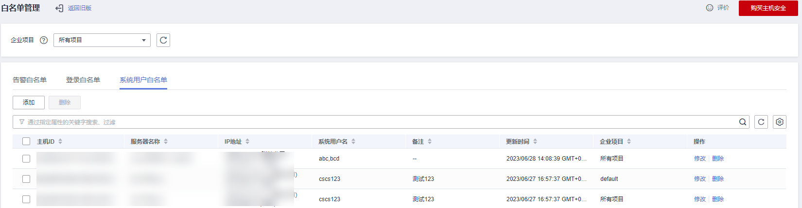

# 配置系统用户白名单

HSS会对主机新添加的root用户组权限用户（非root用户）进行“风险账号“告警。如果是您信任的用户，您可以将该用户添加到系统用户白名单，添加后，HSS将不再对其进行“风险账号“告警。

## 操作步骤

1.  [登录管理控制台](https://console.huaweicloud.com/?locale=zh-cn)。
2.  在页面左上角选择“区域“，单击，选择“安全与合规 \> 主机安全服务”，进入主机安全平台界面。

    **图 1**  进入主机安全  
    

3.  在左侧导航栏，选择“入侵检测  \>  白名单管理“，进入“白名单管理“页面。
4.  （可选）在白名单管理页面左上方，“企业项目“选择主机所属的企业项目或“所有项目“。

    如果您没有开通企业项目，可跳过此步骤。

5.  选择“系统用户白名单“页签，单击“添加“。

    **图 2**  配置系统用户白名单  
    

6.  在“添加系统用户白名单“弹窗中填写主机ID、系统用户名以及备注信息。
7.  单击“确认“，添加完成。

## 相关操作

**修改系统用户白名单**

1.  （可选）在白名单管理页面左上方，“企业项目“选择主机所属的企业项目或“所有项目“。

    如果您没有开通企业项目，可跳过此步骤。

2.  在需要修改的系统用户白名单所在行的“操作”列，单击“修改“。
3.  在“修改系统用户白名单“弹窗中完成信息修改后，单击“确认“。

**删除系统用户白名单**

1.  （可选）在白名单管理页面左上方，“企业项目“选择主机所属的企业项目或“所有项目“。

    如果您没有开通企业项目，可跳过此步骤。

2.  在需要删除的系统用户白名单所在行的“操作”列，单击“删除“。

    当多个系统用户白名单需要删除时，您可以勾选所有目标系统用户白名单，在系统用户白名单列表左上角，单击“删除“。

3.  在弹出的窗口，单击“确认“。

