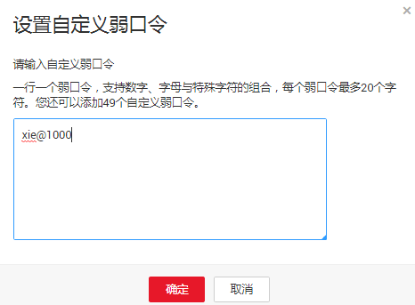

# 配置自定义弱口令

该任务指导用户配置自定义弱口令。如果用户在弹性云服务器中使用了自定义弱口令中的口令，系统将会报口令风险。

## 前提条件

已获取管理控制台的登录账号与密码。

## 操作步骤

1.  登录管理控制台。
2.  在页面上方，单击“服务列表“，选择“安全  \>  企业主机安全“。
3.  在左侧导航树中，选择“安装与配置“，进入“安装与配置“界面。
4.  选择“安全配置“页签，在“自定义弱口令“页面，单击“自定义弱口令“。

    > **说明：**   
    >单击“删除“，可以删除自定义弱口令库中的全部口令。  

5.  在弹出的对话框中，添加要设置的弱口令，也可以删除或修改已有弱口令。

    **图 1**  输入弱口令  
    

6.  单击“确定“，完成自定义弱口令的配置。

