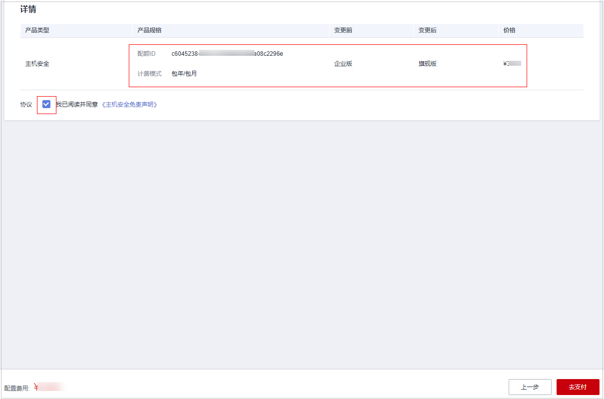
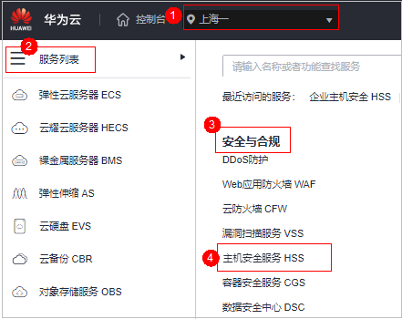
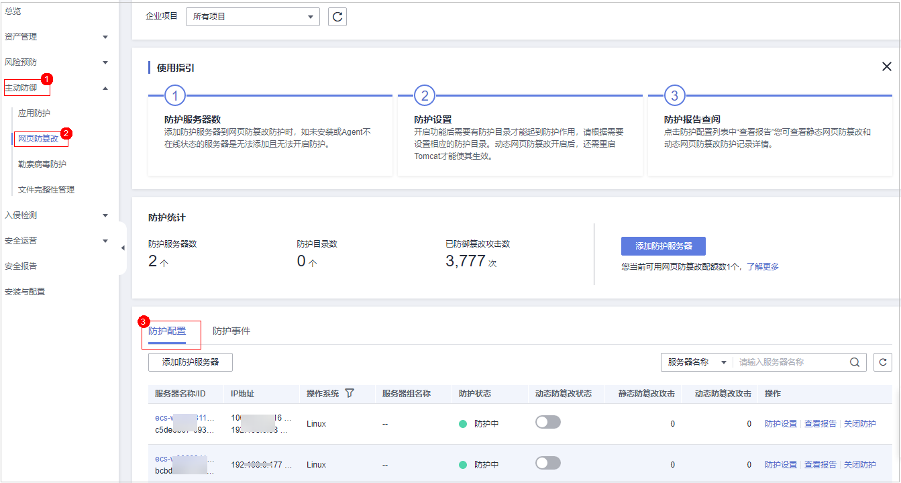
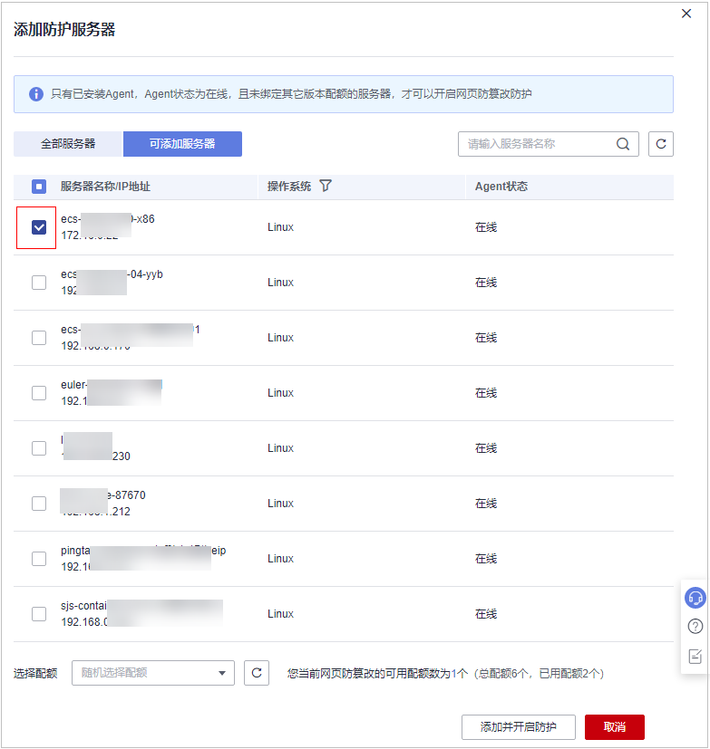

# 配额版本升级

当已购买版本的能力无法满足防护需求，您可通过升级当前版本来满足安全防护需求。

## 升级说明

-   旗舰版、网页防篡改版、容器版为高配置版本，不支持升级，您可以单独购买这些配额。
-   基础版、专业版、企业版支持升级为更高配置的配额版本。
    -   基础版：可升级为专业版、企业版或旗舰版。
    -   专业版：可升级为企业版或旗舰版。
    -   企业版：可升级为旗舰版。

## 前提条件

-   准备进行升级的防护配额“使用状态“必须为“空闲“。
-   准备进行升级的防护配额“配额状态“必须为“正常“。

## 升级至专业版/企业版/旗舰版

升级时目标配额若绑定服务器处于使用中状态，您需要关闭该服务器防护，释放配额，释放后进行升级操作。

1.  [登录管理控制台](https://console.huaweicloud.com/?locale=zh-cn)。
2.  在页面左上角选择“区域“，单击，选择“安全与合规 \> 主机安全服务”，进入主机安全平台界面。

    **图 1**  进入主机安全  
    

3.  在左侧选择“资产管理  \>  主机管理“页面，选择“防护配额“页签，进入防护配额列表页面，点击目标选项可进行筛选查看。

    > **说明：** 
    >如果您的服务器已通过企业项目的模式进行管理，您可选择目标“企业项目“后查看或操作目标企业项目内的资产和检测信息。

4.  在防护配额列表页面，可筛选出基础版或企业版空闲的配额，勾选需升级的配额，单击“升级规格“。

    > **说明：** 
    >-   若需要升级的配额处于绑定状态，则需要先对目标配额进行[解除绑定](解绑配额.md)，然后按照此步骤进行升级。
    >-   解除绑定不影响业务使用。

5.  进入页面规格确认页面，确认升级规格信息。

    > **说明：** 
    >若升级的目标版本为基础版，则升级规格版本可选择企业版或旗舰版，若升级的版本为企业版，则默认升级后规格版本为旗舰版。

    **图 2**  确认升级规格信息  
    

6.  确认升级版本无误，单击“立即购买“。

    > **说明：** 
    >升级购买只需支付新增部分的价格。

7.  进入购买信息确认页面，确认购买信息无误，勾选“我已阅读同意《主机安全免责声明》“，单击“去支付“。

    **图 3**  确认升级购买信息  
    

8.  支付完成后，回到[查看配额](查看配额.md)页面，通过配额ID找到目标配额，查看版本类型为需要升级的目标版本，表示升级成功。
9.  升级成功后按照[绑定配额](绑定防护配额.md)的操作进行重新绑定目标服务器即可开启防护。

## 升级至网页防篡改

升级的目标规格为网页防篡改版时，需购买网页防篡改版本配额，购买后若目标服务器处于防护状态需将目标服务器防护关闭，重新为目标服务器绑定网页防篡改版配额。

1.  [登录管理控制台](https://console.huaweicloud.com/?locale=zh-cn)。
2.  在页面左上角选择“区域“，单击，选择“安全与合规 \> 主机安全服务”，进入主机安全平台界面。

    **图 4**  进入主机安全  
    

3.  在界面右上角，单击“购买主机安全“，进入“购买主机安全配额“界面。
4.  在“购买主机安全配额“界面，选择网页防篡改版，参数说明如[表1](#table202855532396)所示。

    **表 1**  购买主机安全参数说明

    
    <table><thead align="left"><tr id="hss_01_0229_row3286653183911"><th class="cellrowborder" valign="top" width="10.59105910591059%" id="mcps1.2.4.1.1">
参数名称

    </th>
    <th class="cellrowborder" valign="top" width="75.67756775677567%" id="mcps1.2.4.1.2">
参数说明

    </th>
    <th class="cellrowborder" valign="top" width="13.731373137313732%" id="mcps1.2.4.1.3">
取值样例

    </th>
    </tr>
    </thead>
    <tbody><tr id="hss_01_0229_row13286125333916"><td class="cellrowborder" valign="top" width="10.59105910591059%" headers="mcps1.2.4.1.1 ">
计费模式

    </td>
    <td class="cellrowborder" valign="top" width="75.67756775677567%" headers="mcps1.2.4.1.2 ">
根据您的需求选择“包年/包月”或“按需”计费模式。

    <ul id="hss_01_0229_ul1624165434113"><li>包年/包月：在版本选择时可选择基础版、专业版、企业版、旗舰版、网页防篡改版和容器版，单次购买固定的版本使用周期，费用方面比“按需”付费方式每月优惠30%，如果您长期使用，建议包周期购买。</li><li>按需：当前购买页支持选择企业版，开启防护需要在服务器列表页开启。按实际使用的时长收费，以小时为单位，每小时整点结算，不设最低消费标准。
 说明： 

开启按需防护步骤：

    <ol id="hss_01_0229_ol531212552719"><li>在购买页选择按需，默认选择企业版，在页面右下角单击“立即开通”，页面跳转到云服务器列表页面。</li><li>在云服务器列表的“操作”列单击“开启防护”，“计费模式”选择“按需计费”，“主机安全版本”选择“企业版”。</li><li>确认信息无误，单击“确认”完成开启。</li></ol>
    

    </li></ul>
    </td>
    <td class="cellrowborder" valign="top" width="13.731373137313732%" headers="mcps1.2.4.1.3 ">
包年/包月

    </td>
    </tr>
    <tr id="hss_01_0229_row1528612539398"><td class="cellrowborder" valign="top" width="10.59105910591059%" headers="mcps1.2.4.1.1 ">
区域

    </td>
    <td class="cellrowborder" valign="top" width="75.67756775677567%" headers="mcps1.2.4.1.2 "><ul id="hss_01_0229_ul959193235018"><li>配额的“区域”建议与主机的“区域”相同。</li><li>HSS不支持跨区域使用，如果您购买了与主机不在同一区域的配额，请退订配额后重新购买主机所在区域的配额。</li><li>仅在“华北-北京一”、“华北-北京四”、“华东-上海一”、“华东-上海二”、“华南-广州”可接入非华为云的主机，请在以上区域内购买防护配额，并使用以上区域内的安装包或安装命令为非华为云主机安装Agent。</li></ul>
    </td>
    <td class="cellrowborder" valign="top" width="13.731373137313732%" headers="mcps1.2.4.1.3 ">
华北-北京一

    </td>
    </tr>
    <tr id="hss_01_0229_row192861153113916"><td class="cellrowborder" valign="top" width="10.59105910591059%" headers="mcps1.2.4.1.1 ">
版本选择

    </td>
    <td class="cellrowborder" valign="top" width="75.67756775677567%" headers="mcps1.2.4.1.2 ">
支持购买的版本有“基础版”、“专业版”、“企业版”、“旗舰版”、“网页防篡改版”和“容器版”。各版本的功能差异详情请参见<a href="https://support.huaweicloud.com/productdesc-hss2.0/hss_01_0136.html#section2" target="_blank" rel="noopener noreferrer">服务版本差异</a>。

    
 须知： 
<ul id="hss_01_0229_ul139171016131"><li>首次开启基础版可免费体验30天，体验结束后进行购买即可。</li><li>若您购买的是基础版/企业版/旗舰版配额，请在“资产管理 &gt; 主机管理 &gt; 云服务器”页面开启防护，详细操作请参见<a href="https://support.huaweicloud.com/usermanual-hss2.0/hss_01_0230.html" target="_blank" rel="noopener noreferrer">基础版/企业版/旗舰版</a>。</li><li>若您购买的是网页防篡改版配额，请在“主动防御 &gt; 网页防篡改 &gt; 防护配置”页面开启防护，详细操作请参见<a href="https://support.huaweicloud.com/usermanual-hss2.0/hss_01_0214.html" target="_blank" rel="noopener noreferrer">网页防篡改版</a>。</li><li>若您购买的是容器版配额，请在“资产管理 &gt; 容器管理 &gt; 容器节点管理”页面开启防护。</li></ul>
    

    </td>
    <td class="cellrowborder" valign="top" width="13.731373137313732%" headers="mcps1.2.4.1.3 ">
企业版

    </td>
    </tr>
    <tr id="hss_01_0229_row12286105393911"><td class="cellrowborder" valign="top" width="10.59105910591059%" headers="mcps1.2.4.1.1 ">
企业项目

    </td>
    <td class="cellrowborder" valign="top" width="75.67756775677567%" headers="mcps1.2.4.1.2 ">
企业项目针对企业用户使用，只有开通了企业项目的客户，或者权限为企业主账号的客户才可见。如需使用该功能，请联系您的客户经理申请开通。

    
企业项目是一种云资源管理方式，企业项目管理服务提供统一的云资源按项目管理，以及项目内的资源管理、成员管理。

    
从下拉列表中选择所在的企业项目。

    
 说明： 
<ul id="hss_01_0229_ul5864176185417"><li>选择企业项目后，产生的费用和资源均在企业项目内。</li><li>“default”为默认企业项目，账号下原有资源和未选择企业项目的资源均在默认企业项目内。</li><li>只有注册的华为账号购买HSS时，“企业项目”下拉列表中才可以选择到“default”。</li></ul>
    

    </td>
    <td class="cellrowborder" valign="top" width="13.731373137313732%" headers="mcps1.2.4.1.3 ">
default

    </td>
    </tr>
    <tr id="hss_01_0229_row32861053113919"><td class="cellrowborder" valign="top" width="10.59105910591059%" headers="mcps1.2.4.1.1 ">
购买时长

    </td>
    <td class="cellrowborder" valign="top" width="75.67756775677567%" headers="mcps1.2.4.1.2 "><ul id="hss_01_0229_ul6234182410556"><li>根据您的需求选择时长，“按需”模式无需选择。</li><li>为避免因服务到期未及时续费导致您的主机遭受攻击，建议勾选“自动续费”。</li><li>勾选“自动续费”后，当购买的主机安全服务到期时，如果账号余额充足，系统将自动为购买的主机安全服务续费，续费周期与购买时长保持一致。</li><li>若未勾选自动“自动续费”，在即将到期时，请手动续费。</li></ul>
    </td>
    <td class="cellrowborder" valign="top" width="13.731373137313732%" headers="mcps1.2.4.1.3 ">
1年

    </td>
    </tr>
    <tr id="hss_01_0229_row1428765313393"><td class="cellrowborder" valign="top" width="10.59105910591059%" headers="mcps1.2.4.1.1 ">
防护主机数量

    </td>
    <td class="cellrowborder" valign="top" width="75.67756775677567%" headers="mcps1.2.4.1.2 ">
输入购买主机安全服务防护配额的数量，“按需”模式无需选择。

    
 须知： 
<ul id="hss_01_0229_ul3764175691819"><li>为防止未防护主机感染勒索、挖矿等病毒后传染给其他主机，导致企业内网整体沦陷，购买的主机安全服务数量建议与使用的主机数量保持一致。</li><li>购买成功后不支持增加配额，如需增加配额，请重新购买即可。</li></ul>
    

    </td>
    <td class="cellrowborder" valign="top" width="13.731373137313732%" headers="mcps1.2.4.1.3 ">
20

    </td>
    </tr>
    <tr id="hss_01_0229_row132874537396"><td class="cellrowborder" valign="top" width="10.59105910591059%" headers="mcps1.2.4.1.1 ">
标签

    </td>
    <td class="cellrowborder" valign="top" width="75.67756775677567%" headers="mcps1.2.4.1.2 ">
标签用于标识云资源，当您拥有相同类型的许多云资源时，可以使用标签按各种维度（例如用途、所有者或环境）对云资源进行分类。

    
如果需要该功能，您的账号需要具备TMS administrator权限，没有该权限您无法为防护配额添加标签并且界面会有“permission error”的错误提示。

    
“按需”模式无需填写。

    </td>
    <td class="cellrowborder" valign="top" width="13.731373137313732%" headers="mcps1.2.4.1.3 ">
data

    </td>
    </tr>
    </tbody>
    </table>

5.  在页面右下角，单击“立即购买“，进入“订单确认“界面。

    费率标准请参见[产品价格详情](https://www.huaweicloud.com/price_detail.html#/hss_detail)。

6.  确认订单无误后，请阅读《主机安全免责声明》并勾选“我已阅读并同意《主机安全免责声明》“。
7.  在弹窗中选择验证方式，单击“获取验证码”，输入验证码后单击“确认”完成支付，购买成功。
8.  在左侧导航树中，选择“主动防御  \>  网页防篡改“，进入“防护配置“界面，单击“添加防护服务器“。

    > **须知：** 
    >-   选择“资产管理  \>  主机管理  \>  云服务器“，进入“云服务器“界面，若目标服务器的“防护状态“为“防护中“，需单击“操作“列的“关闭防护“，解除目标服务器与原配额的绑定关系。
    >-   解除绑定不影响业务正常运行。

    **图 5**  进入防护配置  
    

9.  单击“添加防护服务器“，选择目标服务器，单击“添加并开启防护“，如[图6](#fig427895111212)所示。

    **图 6**  勾选目标服务器  
    

10. 开启防护后，在“资产管理  \>  主机管理  \>  云服务器“查看目标服务器的“版本/到期时间“为“网页防篡改版“表示升级成功。

    > **说明：** 
    >升级成功后，原配额版本可绑定至其他服务器继续防护，若不再需要，可在“资产管理  \>  主机管理  \>  防护配额“页面单击“操作“列“更多“选择“退订“。

