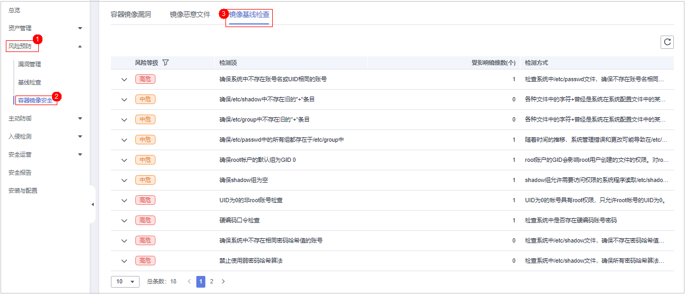
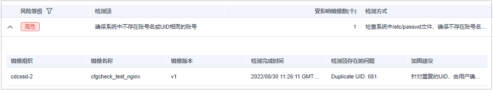

# 镜像基线检查

基线检查功能自动检测您私有镜像仓库中存在的配置风险，针对所发现的问题为您提供加固建议，帮助您正确地处理镜像内的各种风险配置信息，降低入侵风险并满足安全合规要求。

## 检测周期

**主机安全服务每天凌晨**自动进行一次全面的检查。

## 前提条件

已开启容器节点防护。

## 约束限制

仅支持检测Linux镜像存在的配置风险。

## 检测项

-   确保系统中不存在账号名或UID相同的账号
-   UID为0的非root账号检查
-   代码中的口令检查
-   确保系统中不存在相同密码哈希值的账号
-   禁止使用弱密码哈希算法
-   确保帐户密码不为空
-   确保系统中不存在相同组名或GID
-   确保没有非特权账号加入特权组
-   确保/etc/passwd中不存在旧的"+"条目
-   确保/etc/shadow中不存在旧的"+"条目
-   确保/etc/group中不存在旧的"+"条目
-   确保/etc/passwd中的所有组都存在于/etc/group中
-   确保配置了密码有效期
-   确保所有用户的密码更改日期都是过去日期
-   禁用建立host信任
-   禁止建立预置的root级别的信任关系
-   确保root帐户的默认组为GID 0
-   确保shadow组为空

## 操作步骤

1.  [登录管理控制台](https://console.huaweicloud.com/?locale=zh-cn)。
2.  在页面左上角选择“区域“，单击，选择“安全与合规 \> 主机安全服务”，进入主机安全平台界面。

    **图 1**  进入主机安全  
    

3.  在左侧导航树中，选择“风险预防  \>  容器镜像安全“。
4.  选择“镜像基线检查“页签，查看镜像中存在的配置风险。

    **图 2**  镜像基线检查详情  
    

5.  单击检测项前的，查看该检测项的详情、存在的问题及加固建议，并根据加固建议修复有风险的配置信息。

    **图 3**  检测项详情  
    

