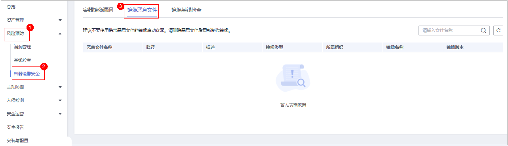

# 镜像恶意文件

容器安全服务能自动检测私有镜像仓库恶意文件，为您展示资产中存在的安全威胁，大幅降低您使用镜像的安全风险。

## 检测周期

容器安全服务**每日凌晨**自动执行一次全面的检测。

## 前提条件

已开启容器节点防护。

## 约束限制

仅支持检测Linux镜像存在的恶意文件。

## 操作步骤

1.  [登录管理控制台](https://console.huaweicloud.com/?locale=zh-cn)。
2.  在页面左上角选择“区域“，单击，选择“安全与合规 \> 主机安全服务”，进入主机安全平台界面。

    **图 1**  进入主机安全  
    

3.  在左侧导航树中，选择“风险预防  \>  容器镜像安全“。
4.  选择“镜像恶意文件“页签，查看私有镜像中恶意文件详情，并根据检测结果删除恶意文件，重新制作镜像。
    -   恶意文件类型如：Trojan、Worm、Virus病毒和Adware垃圾软件等类型。
    -   在“镜像版本“列，单击某个镜像版本号，可查看该镜像版本的漏洞报告详情。

        **图 2**  恶意文件检测详情  
        

