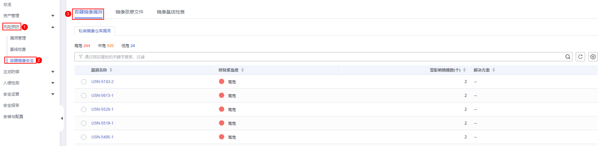
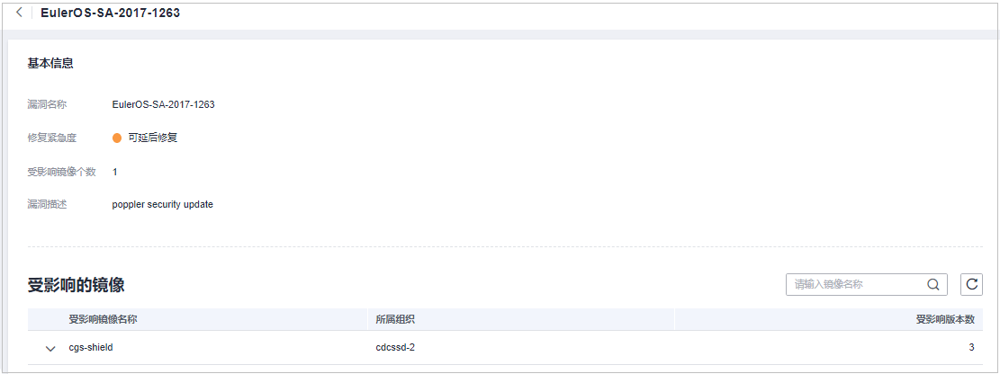

# 镜像漏洞

本章节指导用户查看私有镜像上存在的漏洞，并判断是否需要“忽略“漏洞。

## 前提条件

已开启容器节点防护。

## 检测方式

用户开启容器节点防护后，容器安全服务**自动执行**对Linux镜像的安全扫描。

## 约束限制

仅支持查看Linux镜像存在的漏洞。

## 查看本地镜像漏洞

1.  [登录管理控制台](https://console.huaweicloud.com/?locale=zh-cn)。
2.  在页面左上角选择“区域“，单击，选择“安全与合规 \> 主机安全服务”，进入主机安全平台界面。

    **图 1**  进入主机安全  
    

3.  在左侧导航树中，选择“风险预防  \>  容器镜像安全“，选择“容器镜像漏洞  \>  本地镜像漏洞“页签，查看本地镜像漏洞。

    **表 1**  参数说明

    
    <table><thead align="left"><tr id="row1458118148289"><th class="cellrowborder" valign="top" width="23.392339233923394%" id="mcps1.2.4.1.1">
参数名称

    </th>
    <th class="cellrowborder" valign="top" width="30.073007300730076%" id="mcps1.2.4.1.2">
说明

    </th>
    <th class="cellrowborder" valign="top" width="46.53465346534653%" id="mcps1.2.4.1.3">
操作

    </th>
    </tr>
    </thead>
    <tbody><tr id="row1758101432810"><td class="cellrowborder" valign="top" width="23.392339233923394%" headers="mcps1.2.4.1.1 ">
漏洞名称

    </td>
    <td class="cellrowborder" valign="top" width="30.073007300730076%" headers="mcps1.2.4.1.2 ">
-

    </td>
    <td class="cellrowborder" valign="top" width="46.53465346534653%" headers="mcps1.2.4.1.3 "><ul id="ul4581161419289"><li>单击，查看漏洞详情，包括漏洞ID、漏洞分值、漏洞披露时间和漏洞描述。</li><li>单击漏洞名称，查看该漏洞的基本信息以及受该漏洞影响的镜像列表，具体请参见<a href="#li1997814419471">步骤6</a>。</li></ul>
    </td>
    </tr>
    <tr id="row458111418284"><td class="cellrowborder" valign="top" width="23.392339233923394%" headers="mcps1.2.4.1.1 ">
修复紧急度

    </td>
    <td class="cellrowborder" valign="top" width="30.073007300730076%" headers="mcps1.2.4.1.2 ">
提示您是否需要立刻处理该漏洞。

    </td>
    <td class="cellrowborder" valign="top" width="46.53465346534653%" headers="mcps1.2.4.1.3 ">
-

    </td>
    </tr>
    <tr id="row12582714192810"><td class="cellrowborder" valign="top" width="23.392339233923394%" headers="mcps1.2.4.1.1 ">
当前未处理镜像数（个）

    </td>
    <td class="cellrowborder" valign="top" width="30.073007300730076%" headers="mcps1.2.4.1.2 ">
显示受该漏洞影响的镜像是否全部处理。

    </td>
    <td class="cellrowborder" valign="top" width="46.53465346534653%" headers="mcps1.2.4.1.3 ">
-

    </td>
    </tr>
    <tr id="row8582151412289"><td class="cellrowborder" valign="top" width="23.392339233923394%" headers="mcps1.2.4.1.1 ">
历史受影响镜像数（个）

    </td>
    <td class="cellrowborder" valign="top" width="30.073007300730076%" headers="mcps1.2.4.1.2 ">
显示受该漏洞影响的镜像个数。

    </td>
    <td class="cellrowborder" valign="top" width="46.53465346534653%" headers="mcps1.2.4.1.3 ">
-

    </td>
    </tr>
    <tr id="row65821614112815"><td class="cellrowborder" valign="top" width="23.392339233923394%" headers="mcps1.2.4.1.1 ">
解决方案

    </td>
    <td class="cellrowborder" valign="top" width="30.073007300730076%" headers="mcps1.2.4.1.2 ">
针对该漏洞给出的解决方案。

    </td>
    <td class="cellrowborder" valign="top" width="46.53465346534653%" headers="mcps1.2.4.1.3 ">
单击“解决方案”列的链接，查看修复意见。

    </td>
    </tr>
    </tbody>
    </table>

4.  单击漏洞名称，查看该漏洞的基本信息及受该漏洞影响的镜像列表。

## 查看私有镜像仓库漏洞

1.  登录管理控制台，进入主机安全服务页面。
2.  在左侧导航树中，选择“风险预防  \>  容器镜像安全“，选择“容器镜像漏洞  \>  私有镜像仓库漏洞“页签，查看私有镜像窗口漏洞。

    > **说明：** 
    >单击风险镜像名称，可查看该风险镜像的漏洞概况，包括漏洞名称、修复紧急度、受影响镜像个数、漏洞描述等信息。

    **图 2**  查看私有镜像漏洞  
    

    **表 2**  参数说明

    
    <table><thead align="left"><tr id="row147621398255"><th class="cellrowborder" valign="top" width="23.392339233923394%" id="mcps1.2.4.1.1">
参数名称

    </th>
    <th class="cellrowborder" valign="top" width="30.073007300730076%" id="mcps1.2.4.1.2">
说明

    </th>
    <th class="cellrowborder" valign="top" width="46.53465346534653%" id="mcps1.2.4.1.3">
操作

    </th>
    </tr>
    </thead>
    <tbody><tr id="row1676319392251"><td class="cellrowborder" valign="top" width="23.392339233923394%" headers="mcps1.2.4.1.1 ">
漏洞名称

    </td>
    <td class="cellrowborder" valign="top" width="30.073007300730076%" headers="mcps1.2.4.1.2 ">
-

    </td>
    <td class="cellrowborder" valign="top" width="46.53465346534653%" headers="mcps1.2.4.1.3 "><ul id="ul19763339142517"><li>单击，查看漏洞详情，包括漏洞ID、漏洞分值、漏洞披露时间和漏洞描述。</li><li>单击漏洞名称，查看该漏洞的基本信息以及受该漏洞影响的镜像列表，具体请参见步骤<a href="#li197631039152513">3</a>。</li></ul>
    </td>
    </tr>
    <tr id="row17638394257"><td class="cellrowborder" valign="top" width="23.392339233923394%" headers="mcps1.2.4.1.1 ">
修复紧急度

    </td>
    <td class="cellrowborder" valign="top" width="30.073007300730076%" headers="mcps1.2.4.1.2 ">
提示您是否需要立刻处理该漏洞。

    </td>
    <td class="cellrowborder" valign="top" width="46.53465346534653%" headers="mcps1.2.4.1.3 ">
-

    </td>
    </tr>
    <tr id="row876312396257"><td class="cellrowborder" valign="top" width="23.392339233923394%" headers="mcps1.2.4.1.1 ">
当前未处理镜像数（个）

    </td>
    <td class="cellrowborder" valign="top" width="30.073007300730076%" headers="mcps1.2.4.1.2 ">
显示受该漏洞影响的镜像是否全部处理。

    </td>
    <td class="cellrowborder" valign="top" width="46.53465346534653%" headers="mcps1.2.4.1.3 ">
-

    </td>
    </tr>
    <tr id="row8763173916257"><td class="cellrowborder" valign="top" width="23.392339233923394%" headers="mcps1.2.4.1.1 ">
受影响镜像数（个）

    </td>
    <td class="cellrowborder" valign="top" width="30.073007300730076%" headers="mcps1.2.4.1.2 ">
显示受该漏洞影响的镜像个数。

    </td>
    <td class="cellrowborder" valign="top" width="46.53465346534653%" headers="mcps1.2.4.1.3 ">
-

    </td>
    </tr>
    <tr id="row876343952516"><td class="cellrowborder" valign="top" width="23.392339233923394%" headers="mcps1.2.4.1.1 ">
解决方案

    </td>
    <td class="cellrowborder" valign="top" width="30.073007300730076%" headers="mcps1.2.4.1.2 ">
针对该漏洞给出的解决方案。

    </td>
    <td class="cellrowborder" valign="top" width="46.53465346534653%" headers="mcps1.2.4.1.3 ">
单击“解决方案”列的链接，查看修复意见。

    </td>
    </tr>
    </tbody>
    </table>

3.  单击漏洞名称，查看该漏洞的基本信息及受该漏洞影响的镜像列表。

    **图 3**  漏洞详情  
    

