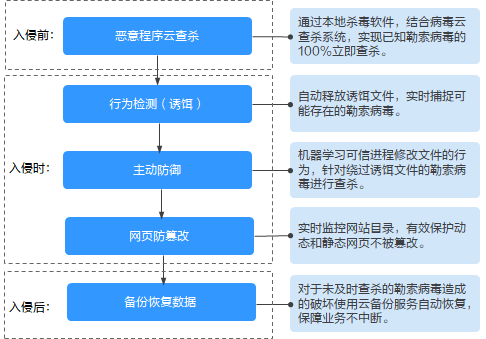

# 防勒索病毒概述

服务器感染勒索病毒越来越普遍，一旦服务器遭受勒索病毒攻击，关键文件会被加密，无法正常使用，企业业务将受到严重影响。HSS针对勒索病毒提供了防勒索解决方案，帮助您从勒索病毒入侵前、入侵时和入侵后全方位应对勒索病毒。

## 工作原理

创建防勒索病毒策略后，HSS可有效监控您云主机上存储的重要文件，防止未经过认证或授权的进程文件对监控文件的加密或修改操作，保障您的主机不被勒索病毒侵害。同时，还可以自动释放诱饵文件，诱捕可能存在的勒索病毒。若您的服务器不慎被勒索病毒入侵，您可以使用云备份服务恢复数据，保障业务不中断。

**图 1**  防勒索病毒工作原理图  

## 功能介绍

创建勒索病毒防护策略后，HSS通过机器学习引擎对服务器运行状态的自动学习和管理端智能分析，完成可信程序的判定。同时，学习服务器上的可信进程修改文件的行为。防护策略学习完成后，自动应用于关联服务器，在防护阶段对非可信程序的操作进行告警。

-   Linux防护勒索
    -   创建Linux防护策略时，若开启诱饵防护，HSS将会在关联服务器上预置诱饵文件。若发现未知勒索病毒加密诱饵文件的行为，立即告警。

        > **说明：** 
        >-   HSS会对预置诱饵文件进行标识，如果您在服务器中发现可疑文件，请确定是否为HSS预置的诱饵文件。
        >-   诱饵文件不会对您的业务产生影响，也不存在任何的恶意行为，若将诱饵文件删除，HSS将无法诱捕新型未知的勒索病毒。

    -   创建Linux防护策略完成后，智能学习策略通过机器学习引擎学习关联服务器上的可信进程修改文件的行为，对绕过诱饵文件的勒索病毒进行告警。

-   Windows防护勒索

    创建Windows防护策略完成后，智能学习策略通过机器学习引擎学习关联服务器上的可信进程修改文件的行为，对非可信进程修改文件的行为进行告警。

