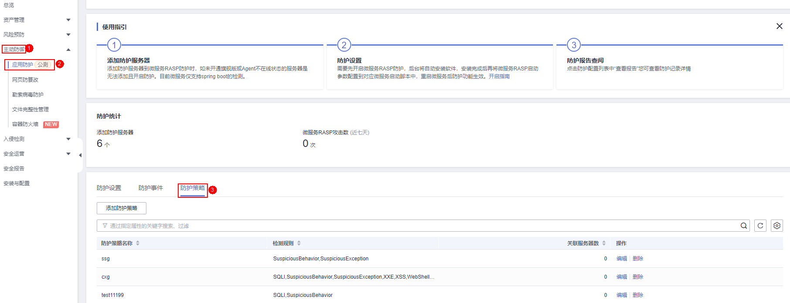
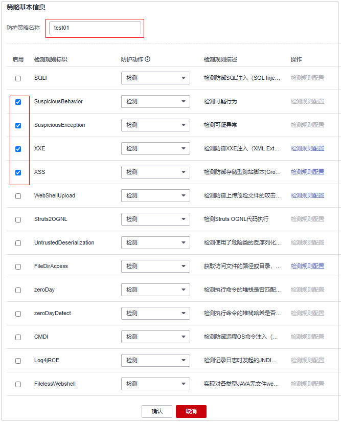
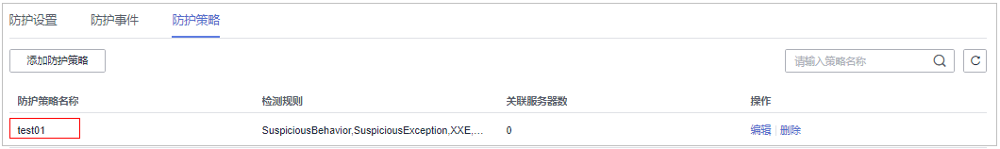
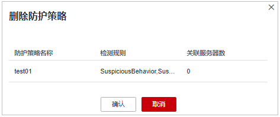

# 防护策略管理

您可自定义添加、编辑、删除应用防护策略，可对策略中的检测规则项及规则配置进行自定义选择和设置。

## 约束限制

-   当前只支持操作系统为Linux的服务器。
-   目前仅支持Java应用接入。
-   已开启主机安全服务版本为旗舰版、网页防篡改版或容器版。

## 添加防护策略

1.  [登录管理控制台](https://console.huaweicloud.com/?locale=zh-cn)。
2.  在页面左上角选择“区域“，单击，选择“安全与合规 \> 主机安全服务”，进入主机安全平台界面。

    **图 1**  进入主机安全  
    

3.  选择“主动防御  \>  应用防护  \>  防护策略“，进入“防护策略“页面，参数说明如[表1](#table18733134319493)所示。

    > **说明：** 
    >如果您的服务器已通过企业项目的模式进行管理，您可选择目标“企业项目“后查看或操作目标企业项目内的资产和检测信息。

    **图 2**  进入防护策略  
    

    **表 1**  防护策略参数说明

    
    <table><thead align="left"><tr id="row19734104312499"><th class="cellrowborder" valign="top" width="25.69%" id="mcps1.2.3.1.1">
参数名称

    </th>
    <th class="cellrowborder" valign="top" width="74.31%" id="mcps1.2.3.1.2">
参数说明

    </th>
    </tr>
    </thead>
    <tbody><tr id="row373404317498"><td class="cellrowborder" valign="top" width="25.69%" headers="mcps1.2.3.1.1 ">
防护策略名称

    </td>
    <td class="cellrowborder" valign="top" width="74.31%" headers="mcps1.2.3.1.2 ">
添加的防护策略的名称。

    </td>
    </tr>
    <tr id="row18734943124917"><td class="cellrowborder" valign="top" width="25.69%" headers="mcps1.2.3.1.1 ">
检测规则

    </td>
    <td class="cellrowborder" valign="top" width="74.31%" headers="mcps1.2.3.1.2 ">
目标策略支持的检测规则项。

    </td>
    </tr>
    <tr id="row5734194354915"><td class="cellrowborder" valign="top" width="25.69%" headers="mcps1.2.3.1.1 ">
关联服务器数

    </td>
    <td class="cellrowborder" valign="top" width="74.31%" headers="mcps1.2.3.1.2 ">
目标策略已绑定的服务器数。

    </td>
    </tr>
    </tbody>
    </table>

4.  单击“添加防护策略“，在弹窗中填写策略名称，勾选该策略需要检测的规则，配置部分检测规则的内容详情，参数说明如[表2](#table926712416599)所示。

    **图 3**  添加防护策略  
    

    **表 2**  应用防护策略参数说明

    
    <table><thead align="left"><tr id="row1826794105914"><th class="cellrowborder" valign="top" width="26.97%" id="mcps1.2.3.1.1">
参数名称

    </th>
    <th class="cellrowborder" valign="top" width="73.03%" id="mcps1.2.3.1.2">
参数说明

    </th>
    </tr>
    </thead>
    <tbody><tr id="row868117224359"><td class="cellrowborder" valign="top" width="26.97%" headers="mcps1.2.3.1.1 ">
防护策略名称

    </td>
    <td class="cellrowborder" valign="top" width="73.03%" headers="mcps1.2.3.1.2 ">
自定义当前添加的策略名称。

    </td>
    </tr>
    <tr id="row72681841115919"><td class="cellrowborder" valign="top" width="26.97%" headers="mcps1.2.3.1.1 ">
启用

    </td>
    <td class="cellrowborder" valign="top" width="73.03%" headers="mcps1.2.3.1.2 ">
当前策略是否启用目标检测规则，需要启用则勾选目标检测规则即可，不启用则不勾选。

    </td>
    </tr>
    <tr id="row1726804111593"><td class="cellrowborder" valign="top" width="26.97%" headers="mcps1.2.3.1.1 ">
检测规则标识

    </td>
    <td class="cellrowborder" valign="top" width="73.03%" headers="mcps1.2.3.1.2 ">
目前支持自定义的选择的所有检测规则标识。

    </td>
    </tr>
    <tr id="row16268164112599"><td class="cellrowborder" valign="top" width="26.97%" headers="mcps1.2.3.1.1 ">
防护动作

    </td>
    <td class="cellrowborder" valign="top" width="73.03%" headers="mcps1.2.3.1.2 ">
选择目标检测规则在检测时防护的动作。

    <ul id="ul1462018852912"><li>检测：针对目标规则的检测对象进行检测，对检测的风险事件进行告警上报。</li><li>检测并阻断/拦截：针对目标规则的检测对象进行检测，对检测的风险事件进行告警上报，同时会对检测到的风险项进行直接阻断或拦截。
 须知： 

阻断或拦截可能导致业务中断风险，请谨慎操作。

    

    </li></ul>
    </td>
    </tr>
    <tr id="row10268241175919"><td class="cellrowborder" valign="top" width="26.97%" headers="mcps1.2.3.1.1 ">
检测规则描述

    </td>
    <td class="cellrowborder" valign="top" width="73.03%" headers="mcps1.2.3.1.2 ">
对目标防护策略的检测对象及行为的描述。

    </td>
    </tr>
    </tbody>
    </table>

5.  单击“操作“列支持“检测规则配置“的项，可自定义修改目标检测规则的规则内容，支持的检测规则如[表3](#table33641230134112)所示。

    **表 3**  支持自定义配置规则内容的检测项

    
    <table><thead align="left"><tr id="row1936453064114"><th class="cellrowborder" valign="top" width="19.221922192219225%" id="mcps1.2.4.1.1">
支持自定义配置的检测项

    </th>
    <th class="cellrowborder" valign="top" width="37.973797379737974%" id="mcps1.2.4.1.2">
配置的规则内容描述

    </th>
    <th class="cellrowborder" valign="top" width="42.8042804280428%" id="mcps1.2.4.1.3">
配置规则样例

    </th>
    </tr>
    </thead>
    <tbody><tr id="row1736516309416"><td class="cellrowborder" valign="top" width="19.221922192219225%" headers="mcps1.2.4.1.1 ">
XXE

    </td>
    <td class="cellrowborder" valign="top" width="37.973797379737974%" headers="mcps1.2.4.1.2 ">
自定义配置XXE黑名单的协议。

    </td>
    <td class="cellrowborder" valign="top" width="42.8042804280428%" headers="mcps1.2.4.1.3 ">
.xml;.dtd;

    </td>
    </tr>
    <tr id="row836553017417"><td class="cellrowborder" valign="top" width="19.221922192219225%" headers="mcps1.2.4.1.1 ">
XSS

    </td>
    <td class="cellrowborder" valign="top" width="37.973797379737974%" headers="mcps1.2.4.1.2 ">
自定义配置XSS的屏蔽规则。

    </td>
    <td class="cellrowborder" valign="top" width="42.8042804280428%" headers="mcps1.2.4.1.3 ">
xml;doctype;xmlns;import;entity

    </td>
    </tr>
    <tr id="row1236593014114"><td class="cellrowborder" valign="top" width="19.221922192219225%" headers="mcps1.2.4.1.1 ">
WebShellUpload

    </td>
    <td class="cellrowborder" valign="top" width="37.973797379737974%" headers="mcps1.2.4.1.2 ">
自定义配置检测为黑名单的文件后缀。

    </td>
    <td class="cellrowborder" valign="top" width="42.8042804280428%" headers="mcps1.2.4.1.3 ">
.jspx;.jsp;.jar;.phtml;.asp;.php;.ascx;.ashx;.cer

    </td>
    </tr>
    <tr id="row736643019413"><td class="cellrowborder" valign="top" width="19.221922192219225%" headers="mcps1.2.4.1.1 ">
FileDirAccess

    </td>
    <td class="cellrowborder" valign="top" width="37.973797379737974%" headers="mcps1.2.4.1.2 ">
自定义配置检测为黑名单的路径。

    </td>
    <td class="cellrowborder" valign="top" width="42.8042804280428%" headers="mcps1.2.4.1.3 ">
/etc/passwd;/etc/shadow;/etc/gshadow;

    </td>
    </tr>
    </tbody>
    </table>

6.  确认配置的规则及勾选的检测项无误，单击“确认“，可在防护策略页面查看是否添加完成。

    **图 4**  查看添加的防护策略  
    

## 编辑防护策略

1.  登录管理控制台，进入主机安全服务页面。
2.  选择“主动防御  \>  应用防护  \>  防护策略“，进入“防护策略“页面，参数说明如[表4](#hss_01_0459_table18733134319493)所示。

    > **说明：** 
    >如果您的服务器已通过企业项目的模式进行管理，您可选择目标“企业项目“后查看或操作目标企业项目内的资产和检测信息。

    **图 5**  进入防护策略  
    

    **表 4**  防护策略参数说明

    
    <table><thead align="left"><tr id="hss_01_0459_row19734104312499"><th class="cellrowborder" valign="top" width="25.69%" id="mcps1.2.3.1.1">
参数名称

    </th>
    <th class="cellrowborder" valign="top" width="74.31%" id="mcps1.2.3.1.2">
参数说明

    </th>
    </tr>
    </thead>
    <tbody><tr id="hss_01_0459_row373404317498"><td class="cellrowborder" valign="top" width="25.69%" headers="mcps1.2.3.1.1 ">
防护策略名称

    </td>
    <td class="cellrowborder" valign="top" width="74.31%" headers="mcps1.2.3.1.2 ">
添加的防护策略的名称。

    </td>
    </tr>
    <tr id="hss_01_0459_row18734943124917"><td class="cellrowborder" valign="top" width="25.69%" headers="mcps1.2.3.1.1 ">
检测规则

    </td>
    <td class="cellrowborder" valign="top" width="74.31%" headers="mcps1.2.3.1.2 ">
目标策略支持的检测规则项。

    </td>
    </tr>
    <tr id="hss_01_0459_row5734194354915"><td class="cellrowborder" valign="top" width="25.69%" headers="mcps1.2.3.1.1 ">
关联服务器数

    </td>
    <td class="cellrowborder" valign="top" width="74.31%" headers="mcps1.2.3.1.2 ">
目标策略已绑定的服务器数。

    </td>
    </tr>
    </tbody>
    </table>

3.  单击目标策略“操作“列的“编辑“，可对防护策略名称、支持的检测规则及规则内容进行选择和配置。

    **图 6**  编辑防护策略  
    

    **表 5**  应用防护策略参数说明

    
    <table><thead align="left"><tr id="zh-cn_topic_0000001485420949_row1826794105914"><th class="cellrowborder" valign="top" width="26.97%" id="mcps1.2.3.1.1">
参数名称

    </th>
    <th class="cellrowborder" valign="top" width="73.03%" id="mcps1.2.3.1.2">
参数说明

    </th>
    </tr>
    </thead>
    <tbody><tr id="zh-cn_topic_0000001485420949_row868117224359"><td class="cellrowborder" valign="top" width="26.97%" headers="mcps1.2.3.1.1 ">
防护策略名称

    </td>
    <td class="cellrowborder" valign="top" width="73.03%" headers="mcps1.2.3.1.2 ">
自定义当前添加的策略名称。

    </td>
    </tr>
    <tr id="zh-cn_topic_0000001485420949_row72681841115919"><td class="cellrowborder" valign="top" width="26.97%" headers="mcps1.2.3.1.1 ">
启用

    </td>
    <td class="cellrowborder" valign="top" width="73.03%" headers="mcps1.2.3.1.2 ">
当前策略是否启用目标检测规则，需要启用则勾选目标检测规则即可，不启用则不勾选。

    </td>
    </tr>
    <tr id="zh-cn_topic_0000001485420949_row1726804111593"><td class="cellrowborder" valign="top" width="26.97%" headers="mcps1.2.3.1.1 ">
检测规则标识

    </td>
    <td class="cellrowborder" valign="top" width="73.03%" headers="mcps1.2.3.1.2 ">
目前支持自定义的选择的所有检测规则标识。

    </td>
    </tr>
    <tr id="zh-cn_topic_0000001485420949_row16268164112599"><td class="cellrowborder" valign="top" width="26.97%" headers="mcps1.2.3.1.1 ">
防护动作

    </td>
    <td class="cellrowborder" valign="top" width="73.03%" headers="mcps1.2.3.1.2 ">
选择目标检测规则在检测时防护的动作。

    <ul id="zh-cn_topic_0000001485420949_ul1462018852912"><li>检测：针对目标规则的检测对象进行检测，对检测的风险事件进行告警上报。</li><li>检测并阻断/拦截：针对目标规则的检测对象进行检测，对检测的风险事件进行告警上报，同时会对检测到的风险项进行直接阻断或拦截。
 须知： 

阻断或拦截可能导致业务中断风险，请谨慎操作。

    

    </li></ul>
    </td>
    </tr>
    <tr id="zh-cn_topic_0000001485420949_row10268241175919"><td class="cellrowborder" valign="top" width="26.97%" headers="mcps1.2.3.1.1 ">
检测规则描述

    </td>
    <td class="cellrowborder" valign="top" width="73.03%" headers="mcps1.2.3.1.2 ">
对目标防护策略的检测对象及行为的描述。

    </td>
    </tr>
    </tbody>
    </table>

4.  确认配置的规则及勾选的检测项无误，单击“确认“，可在防护策略页面查看目标策略是否修改完成。

## 删除防护策略

1.  登录管理控制台，进入主机安全服务页面。
2.  选择“主动防御  \>  应用防护  \>  防护策略“，进入“防护策略“页面，参数说明如[表6](#hss_01_0459_table18733134319493_1)所示。

    > **说明：** 
    >如果您的服务器已通过企业项目的模式进行管理，您可选择目标“企业项目“后查看或操作目标企业项目内的资产和检测信息。

    **图 7**  进入防护策略  
    

    **表 6**  防护策略参数说明

    
    <table><thead align="left"><tr id="hss_01_0459_row19734104312499_1"><th class="cellrowborder" valign="top" width="25.69%" id="mcps1.2.3.1.1">
参数名称

    </th>
    <th class="cellrowborder" valign="top" width="74.31%" id="mcps1.2.3.1.2">
参数说明

    </th>
    </tr>
    </thead>
    <tbody><tr id="hss_01_0459_row373404317498_1"><td class="cellrowborder" valign="top" width="25.69%" headers="mcps1.2.3.1.1 ">
防护策略名称

    </td>
    <td class="cellrowborder" valign="top" width="74.31%" headers="mcps1.2.3.1.2 ">
添加的防护策略的名称。

    </td>
    </tr>
    <tr id="hss_01_0459_row18734943124917_1"><td class="cellrowborder" valign="top" width="25.69%" headers="mcps1.2.3.1.1 ">
检测规则

    </td>
    <td class="cellrowborder" valign="top" width="74.31%" headers="mcps1.2.3.1.2 ">
目标策略支持的检测规则项。

    </td>
    </tr>
    <tr id="hss_01_0459_row5734194354915_1"><td class="cellrowborder" valign="top" width="25.69%" headers="mcps1.2.3.1.1 ">
关联服务器数

    </td>
    <td class="cellrowborder" valign="top" width="74.31%" headers="mcps1.2.3.1.2 ">
目标策略已绑定的服务器数。

    </td>
    </tr>
    </tbody>
    </table>

3.  单击目标策略“操作“列的“删除“，在弹窗中确认策略信息无误，单击“确认“，策略删除完成。

    > **须知：** 
    >删除的策略若存在关联的服务器，需先将目标服务器绑定至不会删除的防护策略，否则目标策略删除按钮会处于隐藏状态，无法删除。

    **图 8**  删除防护策略  
    

