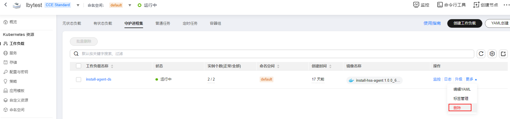

# 集群卸载Agent

如果不再需要HSS为您的集群容器提供安全防护，您可以为集群卸载Agent。Agent卸载后，HSS将停止对容器的检测和防护，且已检测到的告警、漏洞信息等数据都将被删除。

## CCE集群卸载Agent

1.  [登录管理控制台](https://console.huaweicloud.com/?locale=zh-cn)。
2.  在页面左上角选择“区域“，单击，选择“容器  \>  云容器引擎“，进入云容器引擎界面。
3.  单击目标集群名称，进入集群详情页。
4.  在左侧导航栏，选择“工作负载“，进入“工作负载“界面。
5.  选择“守护进程集“页签，删除名称为“install-agent-ds“的工作负载。

    在工作负载所在行的操作列，选择“更多  \>  删除“，删除该工作负载。

    **图 1**  删除install-agent-ds  
    

6.  在页面左上角单击，选择“安全与合规 \> 主机安全服务”，进入主机安全界面。
7.  在左侧导航栏，选择“安装与配置“，进入“安装与配置“界面。
8.  选择“Agent管理  \>  Agent在线“页签，卸载目标CCE集群所有容器节点服务器的Agent。

    详细操作请参见[卸载Agent](卸载Agent.md)。

## 自建集群卸载Agent

1.  登录k8s集群环境。
2.  执行以下命令删除名称为“install-agent-ds“的工作负载。

    **kubectl delete ds install-agent-ds -n default**

3.  [登录管理控制台](https://console.huaweicloud.com/?locale=zh-cn)。
4.  在页面左上角单击，选择“安全与合规 \> 主机安全服务”，进入主机安全界面。
5.  在左侧导航栏，选择“安装与配置“，进入“安装与配置“界面。
6.  选择“Agent管理  \>  Agent在线“页签，卸载目标自建集群所有容器节点服务器的Agent。

    详细操作请参见[卸载Agent](卸载Agent.md)。

