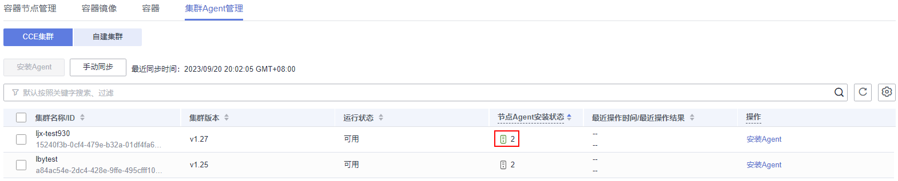

# 集群安装Agent

如果您想要为CCE集群或自建K8s集群下的所有容器开启安全防护，可以通过集群Agent管理功能为集群安装Agent，且使用该功能后，后续集群节点或Pod扩容时，无需您手动安装Agent。

## CCE集群安装Agent

1.  [登录管理控制台](https://console.huaweicloud.com/?locale=zh-cn)。
2.  在页面左上角选择“区域“，单击，选择“安全与合规 \> 主机安全服务”，进入主机安全平台界面。

    **图 1**  进入主机安全  
    

3.  在左侧导航栏中，选择“资产管理  \>  容器管理“，进入“容器管理“界面。
4.  选择“集群Agent管理  \>  CCE集群“页签。
5.  在目标集群所在行的操作列，单击“安装Agent“。

    您也可以勾选所有目标集群，并单击列表左上方的“安装Agent“，批量为CCE集群安装Agent。

6.  在弹窗中单击“确认“，为CCE集群所有节点主机安装Agent。

    安装Agent预计耗时10分钟，请您等待10分钟后，查看Agent安装状态。

    

## 自建集群安装Agent

1.  [登录管理控制台](https://console.huaweicloud.com/?locale=zh-cn)。
2.  在页面左上角选择“区域“，单击，选择“安全与合规 \> 主机安全服务”，进入主机安全平台界面。

    **图 2**  进入主机安全  
    

3.  在左侧导航栏中，选择“资产管理  \>  容器管理“，进入“容器管理“界面。
4.  选择“集群Agent管理  \>  自建集群“页签。
5.  单击“接入自建集群“。
6.  在“接入自建集群“弹窗中，填写集群信息并单击“生成命令“。

    您可以在弹窗中，单击“保存“，保存本次生成的命令。

7.  在可执行k8s命令的主机中创建一个新的yaml文件，例如abcd.yaml。
8.  将生成的命令拷贝到abcd.yaml中。
9.  在主机中执行以下命令，运行abcd.yaml，安装Agent。安装Agent预计耗时10分钟，请您耐心等待。

    **kubectl apply -f abcd.yaml**

10. 命令运行完成后，返回HSS控制台。
11. 在左侧导航栏，选择“安装与配置“，进入“安装与配置“界面。
12. 选择“Agent管理  \>  Agent在线“页签，查看集群服务器的Agent状态为“在线“，表示Agent安装成功。

## 相关操作

-   如果后续您需要修改自建集群信息或查看命令，可在自建集群所在行的操作列单击“编辑“。
-   如果您不再需要HSS保存某个自建集群的信息，可在自建集群所在行的操作列单击“删除“。

