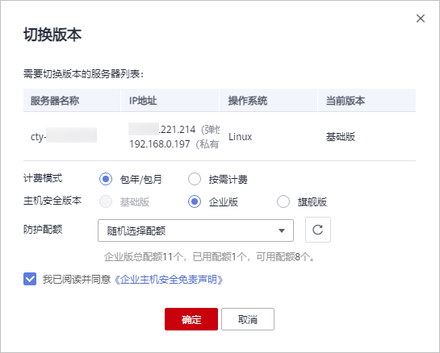
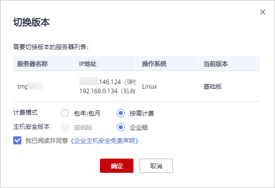

# （可选）步骤五：切换主机安全版本

您可以根据需要将企业主机安全服务的版本切换为“基础版（按需计费）“、“基础版（包年/包月）“、“企业版（按需计费）“、“企业版（包年/包月）“或者“旗舰版“。

> **说明：** 
>如果您购买ECS时，勾选了“开通主机安全“，并选择主机安全的“基础版“或者“企业版“，HSS会自动为该ECS安装Agent，并开启“基础版（按需计费）“或者“企业版（按需计费）“防护。此时，若您需要使用购买的包周期配额时，请通过切换版本的方式，开启包周期企业主机安全防护。

## 注意事项

-   按需变更为包周期。

    按需变更为包周期，需要用户购买包周期配额，生成新的订单，用户支付订单后，包周期配额立即生效。包周期配额生效后，需要用户在云服务器列表页面，勾选目标主机，单击“开启防护“，选择包周期防护配额，直接开启包周期配额防护。

-   包周期变更为按需。

    包周期转按需，需要用户在云服务器列表页面，勾选目标主机，单击“开启防护“，选择按需防护，按需的资费模式才会生效。

-   若企业主机安全服务的版本由高版本版切换为低版本后，主机遭受攻击的可能性将升高。
-   仅支持将主机安全防护的版本切换为“基础版“、“企业版“或者“旗舰版“，如需使用“网页防篡改版“，请先购买“网页防篡改版“的配额，再开启网页防篡改防护。

## 切换版本前准备

-   “企业主机安全  \>  主机管理“页面“云服务器“中目标主机的“Agent状态“为“在线“，且已开启主机防护。
-   切换为包周期配额版本时，需重新为主机指定相应的配额，变更版本前请先购买数量充足的配额。
-   切换为低版本前，请对主机执行相应的检测，处理已知风险并记录操作信息，避免运维失误，使您的主机遭受攻击。

## 切换版本

1.  [登录管理控制台](https://console.huaweicloud.com)。
2.  在页面左上角选择“区域“，单击，选择“安全  \>  企业主机安全“，进入企业主机安全页面。

    **图 1**  企业主机安全  
    

3.  在左侧导航栏中，选择“主机管理“，进入“云服务器“界面，如[图2](#hss_01_0230_fig4214155420111)所示。

    **图 2**  进入“云服务器”界面  
    

    > **说明：** 
    >云服务器列表仅显示以下主机的防护状态：
    >-   在所选区域购买的华为云主机
    >-   已接入所选区域的非华为云主机

4.  选择需要切换版本的主机，单击“切换版本“。

    > **说明：** 
    >-   “基础版（按需计费）“与“基础版（包年/包月）“之间和“企业版（按需计费）“和“企业版（包年/包月）“之间不能通过“切换版本“功能直接切换主机安全版本，若需切换，请关闭原版本后重新选择待切换的版本。
    >-   您也可以通过在云服务器列表页面，勾选目标主机，在列表上方单击“开启防护“，进行直接切换主机安全版本。

    您可以根据自己的实际场景选择“包年/包月“或者“按需计费“，为主机切换版本。

    -   包年/包月

        在“切换版本“对话框中，“计费模式“选择“包年/包月“，选择“主机安全版本“、分配“防护配额“，阅读并确认“《企业主机安全免责声明》“如[图3](#fig1948371820182)所示。

        **图 3**  切换为包周期主机安全版本  
        

        “防护配额“分配方式：

        -   随机分配：下拉框选择“随机选择配额“，系统优先为主机分发服务剩余时间较长的配额。
        -   指定分配：下拉框选择具体配额ID，您可以为主机分配指定的配额。
        -   批量分配：批量开启防护时，系统会随机为批量选择的主机分配配额。

    -   按需计费

        在“切换版本“对话框中，“计费模式“选择“按需计费“，选择“主机安全版本“，阅读并确认“《企业主机安全免责声明》“，如[图4](#fig4120193142412)所示。

        **图 4**  切换为按需计费主机安全版本  
        

5.  单击“确定“，切换版本。切换主机安全版本后，请在云服务器列表页面查看主机的“版本/到期时间“。

    若目标主机的“版本/到期时间“为切换后的主机安全版本，则表示主机安全版本已切换成功。

## 切换版本后操作

-   切换为低版本后，请及时清理主机中的重要数据、关停主机中的重要业务并断开主机与外部网络的连接，避免因主机遭受攻击而承担不必要的损失。
-   切换为高版本后，请及时对主机执行安全检测、处理主机中的安全隐患并配置必要的功能。
-   切换版本后，您可将空余的配额分配给其他主机继续使用或退订无需使用的配额，避免造成配额资源的浪费。

